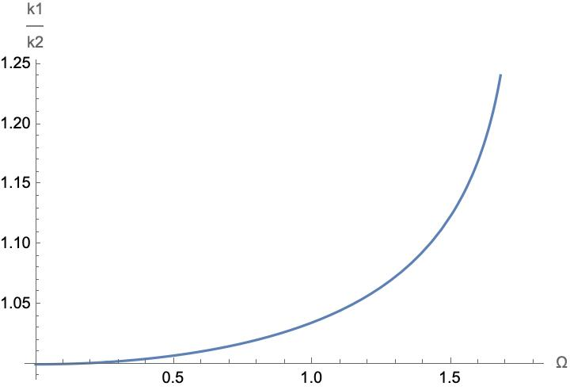
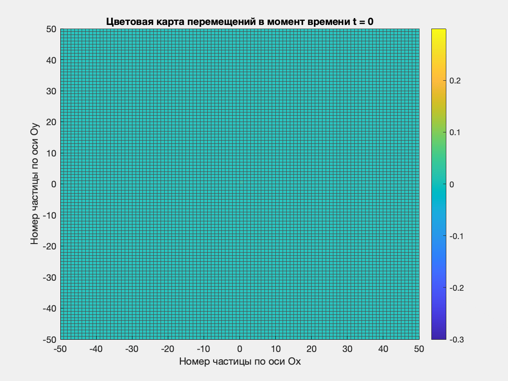
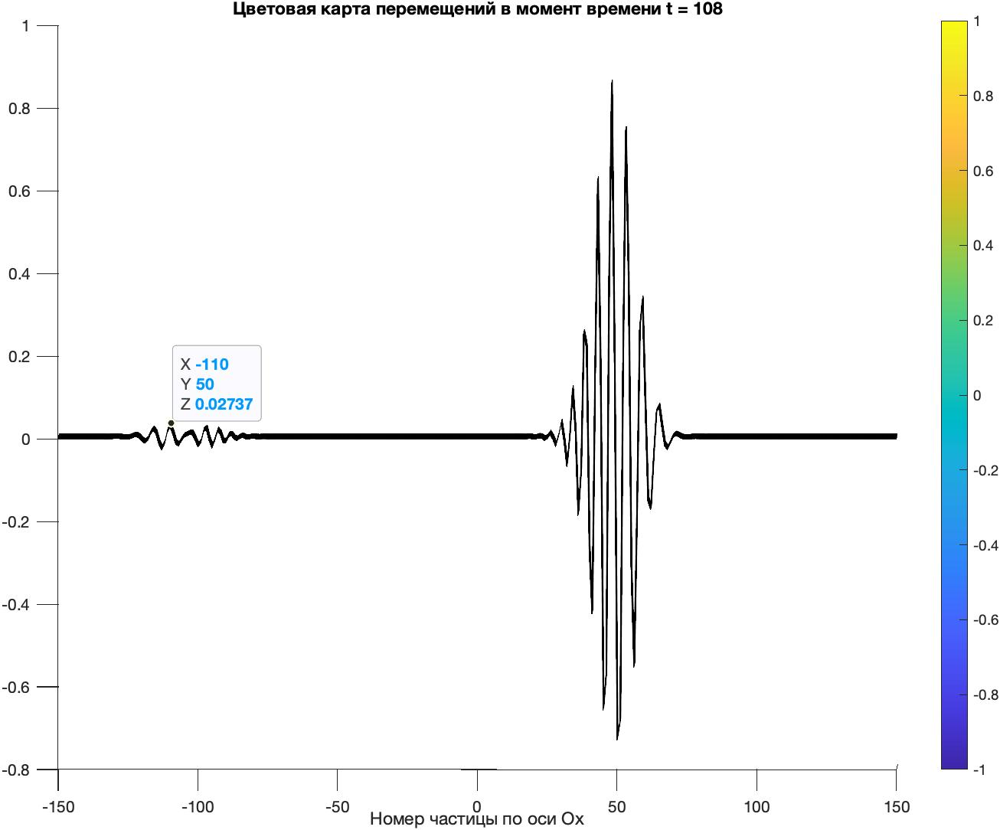
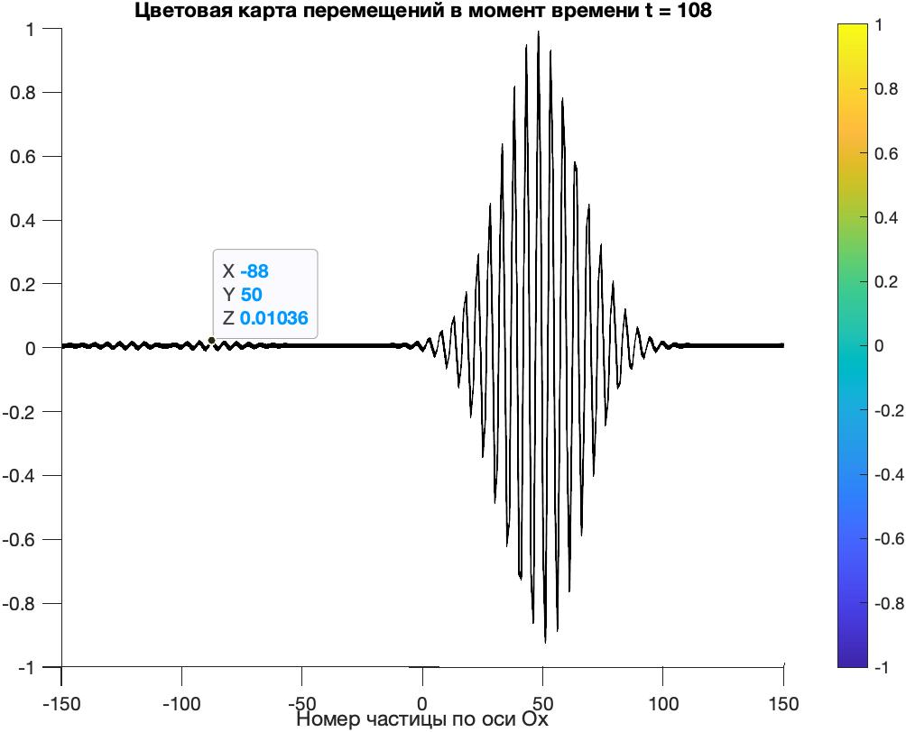

### [Содержание](#содержание)

- [Волна в однородной решётке расплывается и закругляется (вопрос)](#распространение-волны-в-однородной-решётке)

- [Кинематическая нагрузка в центре решётки (заметка)](#заметка-о-распространении-волн-в-однородной-решётке-при-кинематической-нагрузке)

- [Волна при прохождении через интерфейс двух решёток](#волна-при-прохождении-через-интерфейс-двух-решёток)

- [Волна, падающая с заданным углом падения на интерфейс двух решёток](#волна-падающая-с-заданным-углом-падения-на-интерфейс-двух-решёток)

- [Вопросы](#вопросы)

---

## Распространение волны в однородной решётке

При численном моделировании со временем фронт волны закругляется, а сама волна расплывается и заполняет пространство.

Начальные условия заданы в виде волнового пакета:

$$
u_n=u_0\exp{\left(-\frac{\left(\beta^x\right)^2}{2}\left(n-n_0\right)^2\right)}\exp{\left(-\frac{\left(\beta^y\right)^2}{2}\left(m-m_0\right)^2\right)}\sin{\left(nk_1a\right)}
$$

$$
v_n=-u_0\exp{\left(-\frac{\left(\beta^x\right)^2}{2}\left(n-n_0\right)^2\right)}\exp{\left(-\frac{\left(\beta^y\right)^2}{2}\left(m-m_0\right)^2\right)}\left(\Omega\cos{(nk_1a)-\frac{(\beta^x)^2g_1}{a}}\left(n-n_0\right)\sin{(nk_1a)}\right),
$$

где

$$
k_1=\arcsin{\left(\frac{\Omega}{2}\sqrt{\frac{m_1}{C}}\right)\cdot\frac{2}{a}};
$$

$$
g_1=a\sqrt{\frac{C}{m_1}}\cos{\left(\frac{k_1a}{2}\right)}
$$

Эффект закругления волны более заметен при меньшей массе частиц решётки.

При $m=1$:

При $m=0.3$:

Если не задавать в начальном условии (в волновом пакете) экспоненциальное уменьшение амплитуды по оси $Oy$, то тогда волна не закругляется, а только расплывается по оси $Ox$. Компьютерный эксперимент при $m=1$:

---

## Заметка о распространении волн в однородной решётке при кинематической нагрузке

Дисперсионное соотношение:

$$
m \Omega^2=4C\left(\sin^2{\frac{k^xa}{2}}+\sin^2{\frac{k^ya}{2}}\right)
$$

(1) Пусть волна распространяется вдоль оси $Ox$, тогда $k^x=k_1$ ($k^y=0$) и

$$
\sin^2{\frac{k_1a}{2}}=\frac{m\Omega^2}{4C}\Rightarrow k_1=\frac{2}{a}\arcsin{\sqrt{\frac{m\Omega^2}{4C}}}
$$

(2) Пусть волна распространяется под углом $\pi/4$ к оси $Ox$, тогда $k_x=k_y=\frac{k_2}{\sqrt{2}}$ и 

$$
\sin^2{\frac{k_2a}{2\sqrt{2}}}=\frac{m\Omega^2}{8C}\Rightarrow k_2=\frac{2\sqrt{2}}{a}\arcsin{\sqrt{\frac{m\Omega^2}{8C}}}
$$

Таким образом, отношение длин волновых векторов при условиях (1) и (2) запишется в следующем виде:

$$
\frac{k_1}{k_2}=\frac{1}{\sqrt{2}}\frac{\arcsin{\sqrt{\frac{m\Omega^2}{4C}}}}{\arcsin{\sqrt{\frac{m\Omega^2}{8C}}}}
$$

Пусть $m=1$, $C=0.75$ и $a=2$, тогда график зависимости отношения длин волновых векторов (при условиях (1) и (2)) в зависимости от $\Omega$ построен в Wolfram Mathematica:

При $\Omega=1$ получается $k_1\approx1.04 \cdot k_2$.

А при $\Omega=1.6$ получается $k_1\approx1.15 \cdot k_2$ (т.е. у $k_1$ и $k_2$ существенно разные значения).

Проведу численный эксперимент - кинематическое нагружение центральной частицы решётки при $\Omega=1$:

И при $\Omega=1.6$:

При $\Omega=1.6$ заметно, что фронт волны образует скруглённый в вершинах квадрат.

С этим вопросом разобрался. Численный эксперимент качественно согласуется с аналитическими выводами.

---

## Волна при прохождении через интерфейс двух решёток

Пусть $C=0.75$, $a=2$, $\Omega=1$.

Эксперимент при прохождении волны из решётки с $m_1=1$ в решётку с $m_2=0.5$:

Закругления фронта прошедшей волны вызваны тем, что волна в решётке с меньшими массами закругляется и расплывается со временем быстрее.

---

## Волна, падающая с заданным углом падения на интерфейс двух решёток

Пусть $C=0.75$, $a=2$, $\Omega=1.8$, $\gamma=\frac{\pi}{6}$.

Эксперимент при прохождении волны (угол падения равен $\gamma$) из решётки с $m_1=1$ в решётку с $m_2=0.5$:

Пусть $C=0.75$, $a=2$, $\Omega=1$, $\gamma=\frac{\pi}{3}$.

Эксперимент при прохождении волны (угол падения равен $\gamma$) из решётки с $m_1=1$ в решётку с $m_2=0.5$:

## Вопросы

- Почему со временем происходит закругление и расплытие волнового пакета в однородной решётке?

- Почему появляется небольшой волновой пакет, бегущий в обратном направлении при начале движения волнового пакета? Думаю, что из-за приближённого начального условия волнового пакета, так как при уменьшении $\beta^x$ (увеличении ширины пакета) амплитуды в обратнобегущем волновом пакете тоже уменьшаются. Иллюстрация:

 

- По решению алгебраического уравнения для определения волнового числа $k$ из дисперсионного соотношения в случае распространения волны под углом $\gamma$ к оси $Ox$. Сейчас в коде решаю это уравнение численно. Вид уравнения относительно $k$:

$$
m\Omega^2=4C\left(\sin^2{\frac{ak\cos{\gamma}}{2}}+\sin^2{\frac{ak\sin{\gamma}}{2}}\right)
$$

- Существуют ли углы, при которых волна полностью отражается или полностью проходит через границу двух решёток?

- При $k^x<\frac{\pi}{2a}$  и при $k^x>\frac{\pi}{2a}$ разное поведение волнового пакета, бегущего по однородной решётке?

- 

---

## Наблюдения

- В решётке могут распространяться волны с большей частотой, чем в цепочке (так как есть возможность распространяться под углом к векторам решётки)
