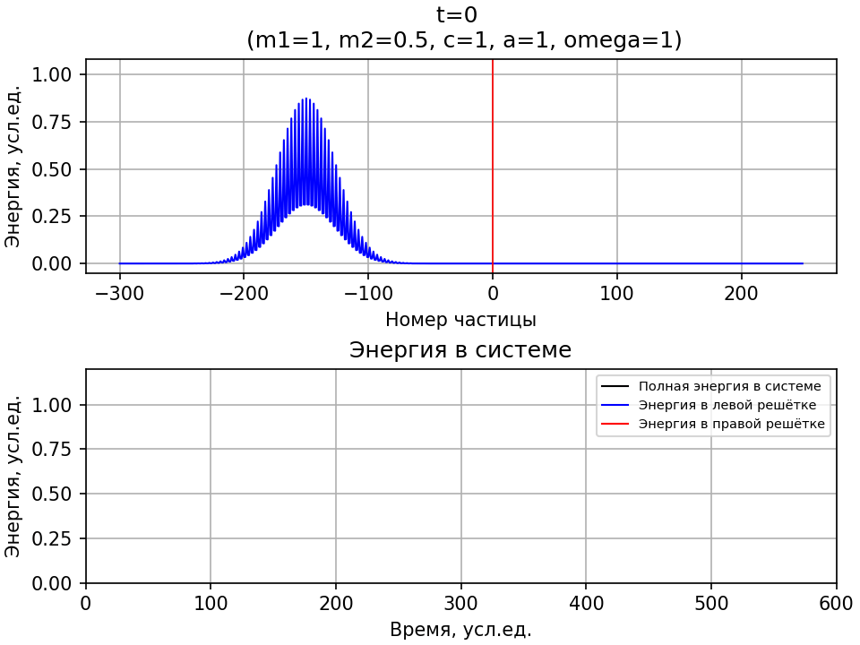

# Распространение волн в неоднородных дискретных средах

Ссылка на файл с заметками по аналитическому решению: [ANALYTICAL EXPRESSIONS](https://mualal.github.io/waves-propagation/main.pdf).

Далее представлен краткий обзор результатов (численных экспериментов + аналитических выводов) и вопросы.

## [Содержание](#содержание)

- [Случай нулевой и отрицательной жёсткости на границе двух цепочек](#случай-нулевой-и-отрицательной-жёсткости-на-границе-двух-цепочек)

- [Мысленный эксперимент. Волна падает на интерфейс двух решёток под углом](#мысленный-эксперимент-волна-падает-на-интерфейс-двух-решёток-под-углом)

- [Мониторинг энергий в системе](#мониторинг-энергий-в-системе)

- [Вопросы](#вопросы)

- [Наблюдения](#наблюдения)

- [Заметки по коду](#заметки-по-коду)

## Случай нулевой и отрицательной жёсткости на границе двух цепочек

При нулевой жёсткости на границе волновой пакет отражается:

## Мысленный эксперимент. Волна падает на интерфейс двух решёток под углом

Из дисперсионного соотношения:

Пусть волна падает на интерфейс под углом $\gamma=\pi/4$. Тогда проекции волнового вектора $k_1^x=k_1^y$.

Пусть выполняется закон синусов для преломления, тогда $k_1^y=k_2^y$. Индекс 1 - для падающей волны; индекс 2 - для проходящей.

Тогда для падающей волны дисперсионное соотношение запишется в виде:

$$
m_1\Omega^2=4C\left(\sin^2{\frac{k_1^x a}{2}+\sin^2{\frac{k_1^xa}{2}}}\right)
$$

Для проходящей волны:

$$
m_2\Omega^2=4C\left(\sin^2{\frac{k_2^x a}{2}+\sin^2{\frac{k_1^xa}{2}}}\right)
$$

Пусть $m_2=0.5m_1$. Тогда из последних двух равенств следует, что $k_2^x=0$.

**Вывод.** Волна, падающая под углом $\gamma=\pi/4$ не пройдёт через интерфейс, если $m_2\leqslant 0.5m_1$. Этот вывод не согласуется с компьютерным экспериментом.

## Мониторинг энергий в системе

Полная энергия в системе сохраняется.

В однородной решётке при невысокой частоте (трансформация в эллипс):

При наличии интерфейса:

При наличии интерфейса под углом:

Для цепочек:

В однородной решётке при частоте, близкой к максимальной (трансформация в ромб с закруглёнными вершинами):

В однородной решётке при максимальной частоте:

## Вопросы

- Почему со временем происходит закругление и расплытие волнового пакета в однородной решётке?

- По решению алгебраического уравнения для определения волнового числа $k$ из дисперсионного соотношения в случае распространения волны под углом $\gamma$ к оси $Ox$. Сейчас в коде решаю это уравнение численно. Вид уравнения относительно $k$:

$$
m\Omega^2=4C\left(\sin^2{\frac{ak\cos{\gamma}}{2}}+\sin^2{\frac{ak\sin{\gamma}}{2}}\right)
$$

- Существуют ли углы, при которых волна полностью отражается или полностью проходит через границу двух решёток?

- При $k^x<\frac{\pi}{2a}$  и при $k^x>\frac{\pi}{2a}$ разное поведение волнового пакета, бегущего по однородной решётке?

- Почему строить скорости лучше, чем перемещения?

- В презентации: что значит резкий и плавный переходы? Постепенное изменение массы (или жёсткостей) на границе?

- 

## Наблюдения

- В решётке могут распространяться волны с большей частотой, чем в цепочке (так как есть возможность распространяться под углом к векторам решётки)
- 

## Заметки по коду

- Сделать возможность вывода на график (монитор энергий) значения с произвольным шагом по времени (сейчас дробные шаги могут выдавать ошибку)

- 
